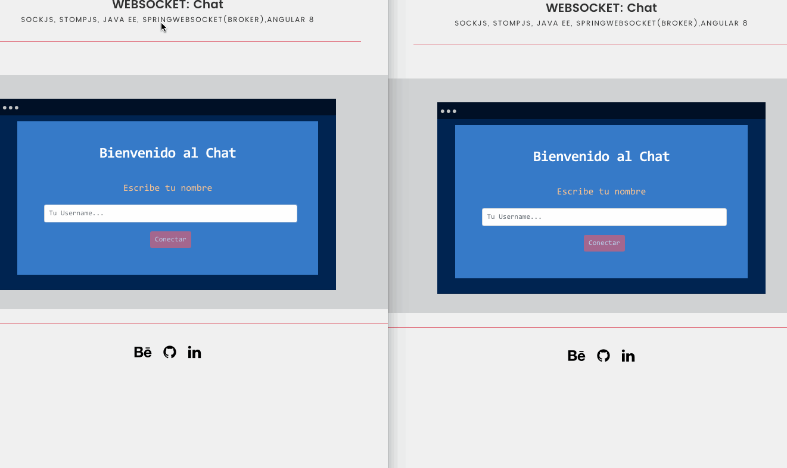

# Websocket Chat
This app it´s a simple bidirectional Chat using Stomp protocol and SocketJs

The project was generated with the following tecnologies: 

Front-end: Angular version 8.3.13, SOCKJS, STOMPJS

Back-end: Java EE, SpringWebsocket(broker)

***important***
If you want test-live the app copy/paste the following link into your browser:

LINK: https://chat-angular-socketjs-app.web.app/chat

# Images of the ChatApp

# Development server
Download the app: install the front-end in angular and the back-end in java(eclipse or springtool)

FIRST:
Run the app in Java run the app with Spring

Next in angular run the app with ng serve -o (localhost:4200/chat)

Copy the link in your browser in another browser to testing the app.

